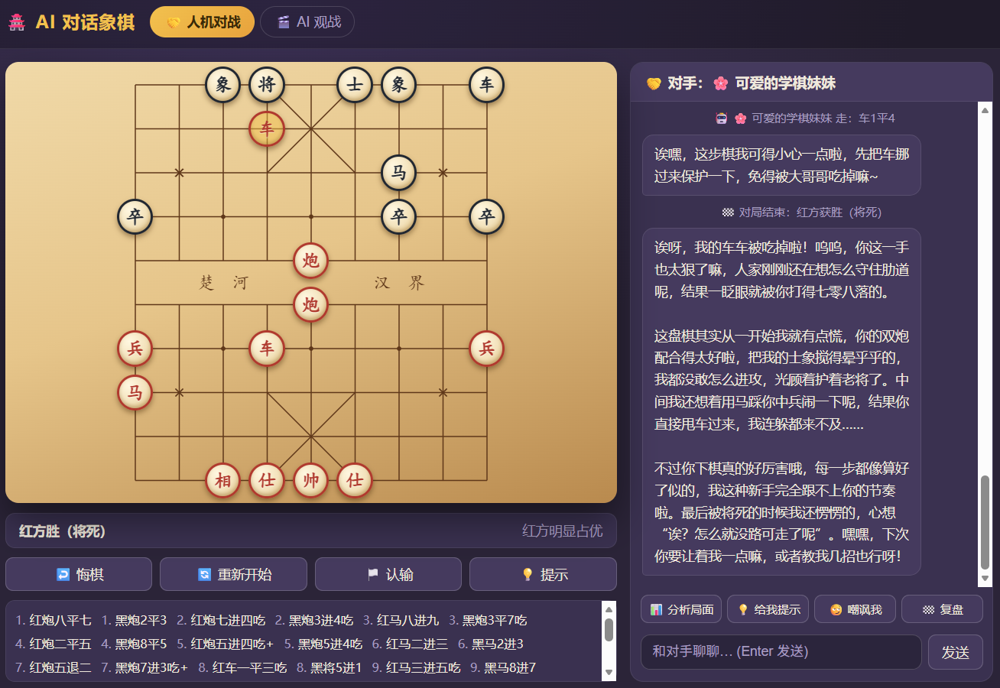

# 🏯 AI 对话象棋

[](LICENSE)
[](https://zoushuling.github.io/ai-chinese-chess/)
[](scripts/serve.js)
[](tests/)

<p align="center">
  
</p>

一个**无需打包、纯前端**的中国象棋网页游戏：本地规则引擎 + 搜索引擎出候选走法，再由接入的大模型（LLM）**按对手人设挑选走法**，实现"有风格的 AI 对战"，并支持随时和 AI 聊天——请教、嘲讽、求指导、看解说、听复盘。

▶️ **在线试玩**：<https://zoushuling.github.io/ai-chinese-chess/>（GitHub Pages 托管，打开即玩，无需安装）

**双击 `index.html` 即可游玩**，也可直接部署到任意静态托管（GitHub Pages / 对象存储 / Nginx）。另有单文件版 **`ai-chinese-chess.html`**：内联全部 CSS/JS，双击即玩并带「📖 说明」弹窗，由 `scripts/build-single-file.js` 自动生成。

> ⚠️ **推荐用「启动游戏.bat」运行**：某些浏览器（Chrome/Edge）对 `file://` 本地文件有限制，可能提示 *"Unsafe attempt to load URL ... 'file:' URLs are treated as unique security origins"*，尤其是文件夹路径含中文时更容易触发。双击 **`启动游戏.bat`** 会启动一个零依赖本地服务器并自动打开 `http://localhost:8800`，完全绕开该限制，对 LLM 接口的 CORS 也更友好。

---

## ✨ 功能一览

| 功能 | 说明 |
| --- | --- |
| 🎭 人机对战 | 玩家执红/黑自选，对手由 LLM 驱动、带人设 |
| 🎬 AI 观战 | 两个不同人设的 AI 互相对弈，你在旁边看戏+聊天 |
| 🤖 有风格的走子 | 本地引擎计算候选走法 → LLM 结合人设棋风挑选 → 引擎校验合法性（非法自动重试，仍失败则回退引擎最优） |
| 💬 聊天面板 | 自由闲聊、📊分析局面、💡给我提示（棋盘高亮）、😏嘲讽我、🏁复盘，全部支持**流式打字机**输出 |
| 😤 自动反应 | 玩家走出明显好棋/坏棋（引擎评估大幅波动）时，AI 按人设概率触发称赞、警惕或嘲讽；一般般的正着不触发 |
| 📣 观战解说 | 观战模式下每步棋由 AI 人设实时点评 |
| 🗣️ AI 配音 | AI 发言可自动朗读：浏览器自带离线语音，或云端 OpenAI 兼容 `/audio/speech`，人设棋风映射不同音调/语速 |
| 👤 人设管理 | 内置 7 套预设（嚣张棋王/老先生/毒舌解说/剑客/学棋妹妹/雌小鬼「小魅」/暴躁老哥），支持可视化新建/编辑自定义人设（语气、棋风、嘲讽度、话痨度、附加指令） |
| 🔌 多模型接入 | OpenAI / DeepSeek / 智谱 GLM / 通义千问 / Moonshot Kimi / 自定义，统一 OpenAI 兼容格式，配置存浏览器本地 |
| ⚙️ 对局功能 | 悔棋（限次，LLM 在线时先嘲讽/裁决，同意才悔棋，态度差可被驳回；离线直接悔棋）、禁止长将（同一局面重复 3 次）、最近一步原位置红点标记、落子/吃子音效（设置可开关）、重新开始、认输、走法提示、AI 棋力（LLM 自由选择 / 搜索深度 1–4）、棋谱导出（中文记谱 + FEN 序列） |

无 API Key 时自动降级：AI 用本地引擎下棋，聊天/分析/复盘输出本地引擎的评估与推荐（不依赖网络）。

---

## 🚀 快速开始

1. **双击 `启动游戏.bat`**（或手动运行 `node scripts/serve.js`），浏览器会自动打开 `http://localhost:8800`。
   - 如果双击 `index.html` 直接打开时遇到 file:// 相关报错，用上面的方式运行即可解决。
2. 点击右上角 **⚙️ 设置**：
   - 选择服务商（预填 Base URL 与默认模型），粘贴你的 **API Key**，点「测试连接」验证。
   - 配置难度、玩家执子、悔棋次数、人设等。
3. 点 **👤 人设** 挑选或编辑对手。
4. 开下！走子后等 AI 应招，随时在右侧聊天框调戏它。

### 各服务商参考配置（OpenAI 兼容接口）

| 服务商 | Base URL | 示例模型 |
| --- | --- | --- |
| OpenAI | `https://api.openai.com/v1` | `gpt-4o-mini` |
| DeepSeek | `https://api.deepseek.com/v1` | `deepseek-chat` |
| 智谱 GLM | `https://open.bigmodel.cn/api/paas/v4` | `glm-4-flash` |
| 通义千问 | `https://dashscope.aliyuncs.com/compatible-mode/v1` | `qwen-plus` |
| Moonshot Kimi | `https://api.moonshot.cn/v1` | `moonshot-v1-8k` |

> ⚠️ 纯前端直连：API Key 仅保存在你自己的浏览器 localStorage 中，请求由浏览器直接发给服务商。若个别服务商对浏览器跨域请求有限制（CORS），请更换服务商或使用支持 CORS 的兼容网关。

---

## 📁 项目结构

```
AI对话象棋/
├── index.html            页面骨架（棋盘 + 聊天 + 弹窗），多文件版入口
├── ai-chinese-chess.html 单文件版（内联 CSS/JS，由 scripts/build-single-file.js 生成，勿手改）
├── 启动游戏.bat          一键启动：本地服务器 + 自动打开浏览器（推荐）
├── LICENSE               MIT 开源协议
├── README.md             项目说明（本文件）
├── AGENT.md              AI 编码代理指南
├── css/style.css         全部样式（木色棋盘、棋子、聊天、弹窗、响应式）
├── js/
│   ├── engine.js         象棋规则引擎：走法生成/将军/将死/困毙/中文记谱/局面评估
│   ├── ai.js             本地搜索引擎：negamax α-β + 迭代加深 + 静态搜索 + 候选走法
│   ├── personas.js       人设预设与自定义（localStorage 持久化）
│   ├── llm.js            OpenAI 兼容客户端：流式 SSE、JSON 提取、连接测试
│   ├── game.js           对局状态机：走子/悔棋/认输/终局/棋谱导出
│   ├── sound.js          落子/吃子音效（Web Audio 合成，无外部文件）
│   ├── tts.js            AI 配音：浏览器 speechSynthesis + 云端 OpenAI 兼容 /audio/speech
│   ├── chat.js           聊天面板：流式渲染、快捷指令、观战解说、复盘
│   └── main.js           主程序：棋盘渲染与交互、人机/观战流程、弹窗装配、设置
├── scripts/
│   ├── serve.js          零依赖静态文件服务器（node scripts/serve.js）
│   └── build-single-file.js  生成单文件版：node scripts/build-single-file.js
├── docs/
│   └── assets/game-preview.png  README 界面预览图（真实游戏截图）
├── .github/workflows/
│   ├── ci.yml            测试 + 单文件版构建校验（push / PR 自动跑）
│   └── pages.yml         推送到 main 后自动启用并部署 GitHub Pages
└── tests/
    ├── test_engine.js    引擎单元测试（node tests/test_engine.js）
    ├── smoke_dom.js      DOM 桩冒烟测试（node tests/smoke_dom.js）
    └── cdp_check.js      CDP 浏览器调试辅助（node tests/cdp_check.js <url>）
```

## 📦 单文件版

`ai-chinese-chess.html` 会把 `css/style.css` 和 `js/` 下的全部模块内联进 `index.html`，并额外提供「📖 说明」弹窗；适合直接双击分发或单文件部署。

```bash
node scripts/build-single-file.js   # 修改源码后重新生成 ai-chinese-chess.html
```

> 该文件是生成产物，请勿直接手改；修改 `index.html` / `css/` / `js/` 后运行上面的命令即可同步。

## 🧪 测试

```bash
node tests/test_engine.js   # 39 项规则引擎测试：走法生成/记谱/将军/将死/困毙/搜索
node tests/smoke_dom.js     # 38 项主流程测试：初始化/点击走子/红点标记/AI 应招/提示/悔棋审批/人设/长将/设置/TTS
```

## 🎮 玩法提示

- 人机模式：点击己方棋子选中（绿色高亮 + 落点提示），再点击目标格走子。
- 观战模式：顶栏切换到「AI 观战」，可暂停/继续，速度在设置中调整。
- 「💡 提示」会高亮引擎推荐的一步并让 AI 解释为什么。
- 走坏棋时 AI 可能嘲讽你——也可以主动点「😏 嘲讽我」找骂 😆

## 📜 技术说明

- 棋盘坐标：row 0–9（上→下），col 0–8（左→右）；红方在下，黑方在上。
- 中文记谱：支持进/退/平、前/中/后、黑方阿拉伯数字、吃子与将军标记。
- 终局判定：将死、困毙（无子可动判负）、认输。
- 引擎：子力价值 + 位置价值表 + MVV-LVA 走法排序 + 静态吃子搜索，深度 1–4 可调。

## 📜 开源协议

本项目以 **MIT License** 开源，详见 [LICENSE](LICENSE) —— 可自由使用、修改、商用，保留版权声明即可。

喜欢的话给个 ⭐ Star，让更多人看到这个项目，谢谢支持！
